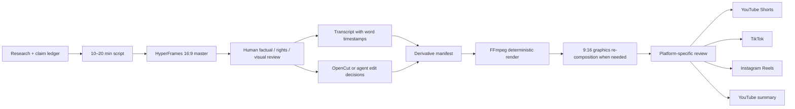

# Long-form distribution pipeline

## Output bundle per investigation

| Asset | Editorial purpose | Typical duration | Frame |
| --- | --- | --- | --- |
| YouTube master | Complete investigation and primary monetization asset | 10–20 min | 16:9 |
| YouTube summary | Condensed mechanism, evidence, and outcome | 3–6 min | 16:9 |
| YouTube Short | One claim or reveal with a route to the master | 25–90 sec | 9:16 |
| TikTok cut | Platform-specific hook and a complete micro-story | 30–120 sec | 9:16 |
| Instagram Reel | Visual teaser or concise evidence sequence | 20–60 sec | 9:16 |

These are editorial targets rather than platform maximums. YouTube currently categorizes square or vertical uploads up to three minutes as Shorts, but the internal profile stays shorter unless the story needs more time. See [YouTube's current Shorts guidance](https://support.google.com/youtube/answer/15424877?hl=en-EN).

## Processing graph



## Edit-decision rules

1. Candidate moments come from the script, transcript, retention hypotheses, and Evidence Room claims—not from arbitrary silence removal alone.
2. Every segment stores `start`, `end`, narrative role, claim IDs, and any required on-screen attribution.
3. OpenCut can be used for human or agent-assisted editorial selection, but its export must become a versioned edit manifest.
4. FFmpeg is the deterministic execution layer for trims, concatenation, audio normalization, caption burn-in, scaling, encoding, thumbnails, and checksums.
5. A static center crop is allowed only when the safe-area check passes. Evidence graphics and timelines are natively re-rendered in 9:16.
6. Each platform version changes at least its opening hook, caption safe area, CTA, metadata, and—where useful—scene order.

## Caption and narration QA

- Generate or record narration in segments so corrections do not require replacing a 20-minute track.
- Back-transcribe Japanese with `hyperframes transcribe narration.wav --model small --language ja`.
- Use an `.en` Whisper model only for audio confirmed to be English.
- Reject transcripts with obvious nonsense, excessive music tokens, or unreliable timings before generating captions.
- Store normalized word IDs so every burned-in caption can be traced back to the master transcript.
- Japanese Kokoro narration must pass through Misaki Japanese G2P before synthesis. The generic direct-text Japanese path is prohibited by the Enron regression test.
- Japanese back-transcription is scored by phonemes to handle legitimate homophones; English is scored by normalized words.
- Production narration runs as correction-sized, content-hashed segments and stops at `review_required` for rights, pronunciation, and caption-sync review.

## FFmpeg execution profile

Simple, single-window vertical cuts can use a deterministic worker command like this:

```powershell
ffmpeg -i master.mp4 -ss 210 -t 60 `
  -vf "scale=1080:1920:force_original_aspect_ratio=increase,crop=1080:1920" `
  -c:v libx264 -crf 18 -preset medium -c:a aac -b:a 192k `
  short-review.mp4
```

This command is not appropriate when the crop removes a speaker, source label, or evidence text. Those sequences use a 9:16 HyperFrames composition, then FFmpeg performs final encoding and media validation.

The repository includes `scripts/render-derivative.ps1` for validated landscape, vertical-fit, and vertical-cover renders. `npm run derivative:sample` exercises the non-destructive vertical-fit path against the local visual pilot.

`scripts/render-edl-derivative.ps1` accepts a versioned JSON edit manifest, renders every selected interval through a common profile, concatenates the normalized segments, and rejects duration mismatches after `ffprobe`. Run `npm run derivative:edl-sample` to produce the three-segment, 13-second reference cut. The manifest keeps narrative roles and claim IDs next to each source interval so an OpenCut adapter can emit the same contract later.

`scripts/validate-transcript.mjs` is the pre-caption quality gate. It rejects language/model mismatches, timestamp reversal or overlap, sub-50ms words, and excessive filler or music tokens; it emits normalized stable word IDs for downstream caption manifests. Run `npm run transcript:validate-sample` before ASS generation or HyperFrames caption composition.

`scripts/adapt-opencut-edl.mjs` converts a serialized OpenCut Classic project into the same versioned EDL contract. Current OpenCut projects use 120,000 integer ticks per second from project version 23 onward; older versions use seconds. The adapter preserves OpenCut element IDs, timeline positions, claim IDs, word IDs, narrative roles, and required attribution. It rejects overlaps, multiple source media IDs, and retimed clips rather than silently changing the editorial result. The compatibility snapshot is pinned to upstream commit `cf5e79e919144200294fb9fed22a222592a0aeea`.

`scripts/generate-ass-captions.mjs` groups validated words into platform-safe ASS events. Each event stores its source word IDs in the ASS `Effect` field and in a sidecar caption manifest. `scripts/fetch-caption-font.mjs` downloads Noto Sans JP from a pinned Google Fonts commit, verifies SHA-256, and caches both the font and SIL OFL license outside Git. `scripts/render-captioned-derivative.ps1` then burns the ASS file with FFmpeg and verifies duration and dimensions.

Run `npm run caption:pipeline-sample` for the complete executable path: OpenCut project JSON -> EDL -> normalized multi-segment cut -> transcript QA -> ASS grouping -> verified font -> caption burn-in -> `ffprobe` validation.

The native vertical reference composition lives at `video/pilot-investigation-vertical`. It is a 28-second, three-scene Evidence Room template with a deterministic Japanese font, explicit ALLEGED/CONFIRMED states, primary-source locators, phone-safe margins, and a human-review end card. It exists to prove re-composition; production derivatives will populate the same scene grammar from a reviewed manifest rather than clone the editorial sequence unchanged.

## Release cadence

- Publish the long-form master first.
- Release the summary only when it serves a different search or viewer need.
- Stagger two to four vertical cuts across the following 7–14 days.
- Feed clip performance back into the next master’s title, opening, and scene rhythm; do not rewrite the factual record based on engagement.
